# CodeMonkeys Crew

<p align="center">
  
  
</p>

> **Multi-agent software engineering on autopilot** — powered by [crewAI](https://crewai.com) & OpenAI.

---

## ✨ Highlights

• **Hierarchical multi-agent crew** (backend, frontend, QA, architect & engineering lead).  
• **Event-driven _Flow_ orchestration** with per-task feedback loops (design → code → review → fixes → QA).  
• **Long-, short- & entity-memory** via vector DB (Chroma) and SQLite LTM.  
• **Zero-config developer experience** — `crewai run` boots a full AI team that ships production-ready code.  
• **Utility DevOps agent** materialises monolithic artefacts into real source files on disk.

---

## 📖 Table of Contents
1. [Quick Start](#-quick-start)  
2. [Workflow Deep-Dive](#-workflow-deep-dive)  
3. [Project Structure](#-project-structure)  
4. [Architecture Diagram](#-architecture-diagram)  
5. [Configuration](#-configuration)  
6. [Contributing](#-contributing)  
7. [License](#-license)

---

## 🚀 Quick Start

```bash
# 1️⃣ Install uv (the ultra-fast Python package manager)
pip install uv

# 2️⃣ Add *your own* product requirements
#    (open `project_requirements.txt` in your editor and describe what you want built)
echo "My awesome idea goes here…" > project_requirements.txt

# 3️⃣ Install dependencies & lock versions
crewai install            # installs from pyproject + uv.lock

# 4️⃣ Add your OpenAI key
cp .env.example .env && echo "OPENAI_API_KEY=sk-..." >> .env

# 5️⃣ Spin up your AI engineering team 🐒
crewai run
```

The architect agent auto-generates a *project name* & *main class* for you, then:
1. Generate a **design doc**.  
2. Break it down into **atomic tasks**.  
3. Implement backend → review → fix → **unit tests**.  
4. Implement frontend → review → fix → **E2E tests**.  
5. Perform **dependency audit** & materialise artefacts.

Open the generated code under `output/<PROJECT>/` — ready to run!

---

## 🔍 Workflow Deep-Dive

Below is the default pipeline executed by `EngineeringFlow`.
Steps with the same background colour run in sequence, arrows denote dependencies.

```mermaid
graph TD
    subgraph Design
        A["Design 📄<br/>architect_agent"]
        B["Task Breakdown 🗂<br/>task_breaker"]
    end
    subgraph Backend
        C["Backend Code 💾<br/>backend_engineer"]
        D["Code Review 🔍<br/>architect_agent"]
        E["Fix Comments 🛠<br/>backend_engineer"]
        F["Unit Tests ✅<br/>test_engineer"]
    end
    subgraph Frontend
        G["Frontend UI 💻<br/>frontend_engineer"]
        H["UI Review 🔍<br/>architect_agent"]
        I["Fix Comments 🛠<br/>frontend_engineer"]
        J["Dependency Audit 📦<br/>architect_agent"]
    end
    subgraph QA
        K["End-to-End Tests 🚦<br/>test_engineer"]
    end
    A --> B --> C --> D --> E --> F
    F --> G --> H --> I --> J --> K
```



Each **code→review→fix** trio can iterate up to *three* rounds if blockers remain.

### 📜 Step-by-Step Crew Flow

1. **Collect Inputs** – `EngineeringFlow` ingests your product requirements from `project_requirements.txt` (or arguments passed to `kickoff()`).
2. **Propose Names** – The *architect_agent* suggests a Python-friendly `project_name` and root `class_name`, and the output directory `output/<PROJECT>/` is created.
3. **Design Document** – The *architect_agent* writes a detailed markdown spec covering modules, classes, and responsibilities.
4. **Task Breakdown** – The *task_breaker* decomposes the spec into atomic, testable engineering tasks.
5. **Backend Implementation** – The *backend_engineer* builds the core Python package following the design.
6. **Backend Review & Fixes** – The *architect_agent* reviews the code; the *backend_engineer* addresses any blocking comments.
7. **Unit Tests** – The *test_engineer* authors pytest-style unit tests to validate the backend.
8. **Frontend Implementation** – The *frontend_engineer* crafts a minimal UI (`app.py`) showcasing the backend functionality.
9. **Frontend Review & Fixes** – The *architect_agent* reviews the UI; the *frontend_engineer* refines it.
10. **Dependency Audit** – The *architect_agent* audits all `requirements.txt` files, pinning safe, stable package versions.
11. **End-to-End Tests** – The *test_engineer* conducts full-stack testing and reports any bugs.
12. **Materialise Code** – The *utility_agent* extracts the monolithic backend artefact into real source files on disk.
13. **Project README** – Finally, the *architect_agent* auto-generates a ready-to-ship README for the generated project.

---

## 🗂 Project Structure

```text
CodeCrew/
├─ src/
│  └─ code_monkeys/
│     ├─ config/         # YAML config for agents & tasks
│     ├─ flows/          # EngineeringFlow orchestrator
│     ├─ tools/          # (Empty) custom tools namespace
│     └─ crew.py         # CrewBuilder & agents definition
├─ output/               # Generated code & reports (git-ignored)
├─ memory/               # Vector & LTM databases (git-ignored)
├─ README.md             # <- you are here
└─ pyproject.toml        # Package metadata & dependency pins
```

---

## ⚙️ Configuration

* **Agents:** customise roles & goals in `src/code_monkeys/config/agents.yaml`.  
* **Tasks:** tweak or reorder steps in `src/code_monkeys/config/tasks.yaml`.  
* **Flows:** extend `EngineeringFlow` (e.g., add Slack notifications) in `src/code_monkeys/flows/`.

---

## 🤝 Contributing

1. Fork the repo and create your feature branch (`git checkout -b feat/my-feature`).  
2. Commit your changes with conventional commits.  
3. Ensure `pytest` passes & `ruff` lints (`uv run lint`).  
4. Open a PR — we ❤️ new contributors!

---

## 📄 License

This project is licensed under the **MIT License** — see the [LICENSE](LICENSE) file for details.

## Understanding Your Crew

The code_monkeys Crew is composed of multiple AI agents, each with unique roles, goals, and tools. These agents collaborate on a series of tasks, defined in `config/tasks.yaml`, leveraging their collective skills to achieve complex objectives. The `config/agents.yaml` file outlines the capabilities and configurations of each agent in your crew.

## Support

For support, questions, or feedback regarding the CodeMonkeys Crew or crewAI.
- Visit our [documentation](https://docs.crewai.com)
- Reach out to us through our [GitHub repository](https://github.com/joaomdmoura/crewai)
- [Join our Discord](https://discord.com/invite/X4JWnZnxPb)
- [Chat with our docs](https://chatg.pt/DWjSBZn)

Let's create wonders together with the power and simplicity of crewAI.
